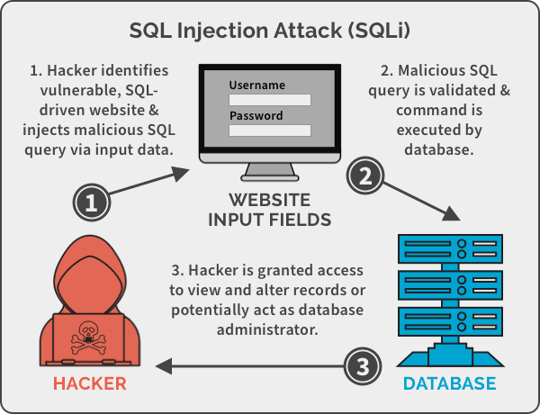

# SQLi

## What is SQLi?

SQL Injection (SQLi) is a security vulnerability that allows attackers to inject malicious SQL code into queries sent to a database. This can lead to unauthorized access to data, data manipulation, or even full control over the database. SQL is a standard language for managing data held in relational database management systems (RDBMS), including MySQL, Oracle, SQL Server, and others.



## Index

1. Basis to tackle SQLi (Below)
2. [Authentication By-Pass](authentication-by-pass.md)
3. [Union Based Attacks](union-based-attacks.md)
4. [Blind Injections](blind-injections.md)
5. [Time-Based Blind Injections](time-based-blind-injections.md)
6. [Error Based Injections](error-based-injections.md)
7. [Second Order Injections](second-order-injections.md)

## Basis to Tackle SQLi Challenges
* Look for places from where data might be used to construct a query. Like a textbox, or the url of the website.
* An SQL query is a command used to get data out of a database.
* Basic SQL syntax:

    1. **`SELECT`** Extracts data from the given table.
    ```sql
    -- Example: Selects all columns from the "customers" table
    SELECT * FROM customers;
    ```

    2. **`--`** Comments out the remainder of the line. The code after `--` is ignored.
    ```sql
    -- This is a comment and will not be executed
    SELECT * FROM customers; -- This part is ignored
    ```

    3. **`ORDER BY`** Orders the results obtained from SELECT in a specific manner. For example, if one has a table of countries and their populations, one can select the countries starting with the letter R and then order them by their population.
    ```sql
    -- Example: Select countries starting with 'R' and order by population
    SELECT * FROM countries
    WHERE name LIKE 'R%'
    ORDER BY population;
    ```

    4. **`UNION`** clause allows you to group multiple queries together.
    ```sql
    -- Example: Combine results from two SELECT statements
    SELECT name FROM employees
    WHERE department = 'Sales'
    UNION
    SELECT name FROM contractors
    WHERE department = 'Sales';
    ```

    5. **`JOIN`** Joins data from two tables depending on a certain characteristic on the table. For example, if there's a table with customer IDs and their addresses and another table with customer IDs and their purchases, you can join both tables so that the customer addresses match their purchases.
    ```sql
    -- Example: Join customers and orders tables on customer_id
    SELECT customers.name, orders.product
    FROM customers
    JOIN orders ON customers.customer_id = orders.customer_id;
    ```

    6. **`DELETE, INSERT`** Allows you to delete data or add new data to a table.
    ```sql
    -- Example: Insert a new customer into the customers table
    INSERT INTO customers (name, address)
    VALUES ('John Doe', '123 Main St');

    -- Example: Delete a customer from the customers table
    DELETE FROM customers
    WHERE name = 'John Doe';
    ```

    7. **`AND, OR`** Allows you to modify queries so that they return information depending on multiple categories.
    ```sql
    -- Example: Select employees who are in the Sales department and have a salary greater than 50000
    SELECT * FROM employees
    WHERE department = 'Sales' AND salary > 50000;

    -- Example: Select employees who are in the Sales department or have a salary greater than 50000
    SELECT * FROM employees
    WHERE department = 'Sales' OR salary > 50000;
    ```

    8. **`MIN, MAX`** They return the smallest or largest value of a query.
    ```sql
    -- Example: Get the minimum and maximum salary from the employees table
    SELECT MIN(salary) AS min_salary, MAX(salary) AS max_salary
    FROM employees;
    ```

    9. **[More here..](https://www.datacamp.com/cheat-sheet/sql-basics-cheat-sheet)**


<!-- *   DevTools is a great all-in one tool for starting with WEB-based CTF questions. Instead of having to learn so many specific softwares in the start, you can begin with using DevTools for the questions. As in case you need to check which type of server the website is running press `F12` or `Ctrl+Shift+I` and then go to the networks tab.

    

    There click on the file having the same name as the website and scroll down the headers tab.

    

    Here you can find the type of server (Example Python, NodeJs ... etc) which can be useful in some problem when you need to perform Server-Specific Injections.

    

    In this example, it is running on a proprietary web server software made and used by Google.
*   In the same tab above, you can also find many other useful things such as cookies (Keep an out for them, many times you can find hidden data and clues there) and the request sent by the browser.

     -->